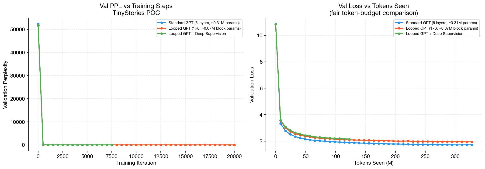
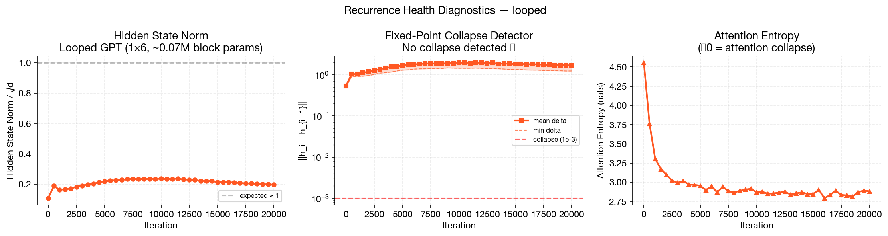
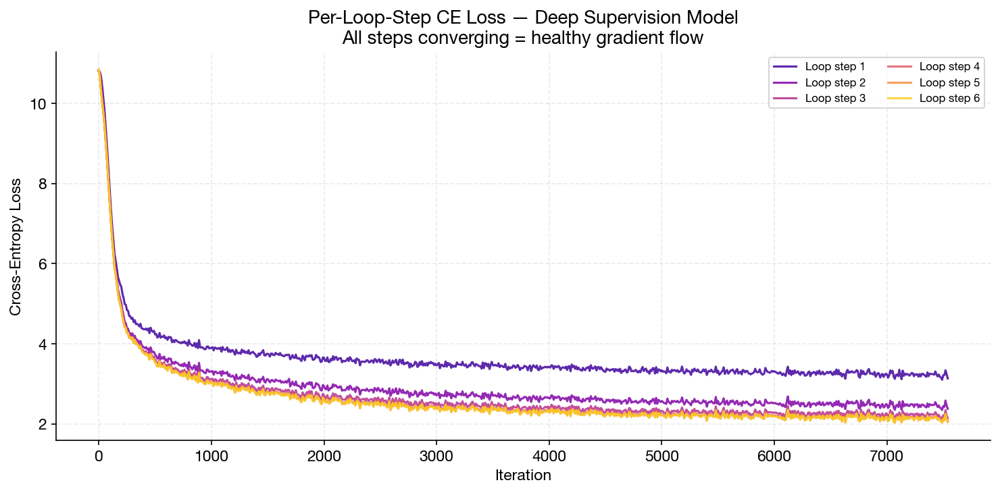
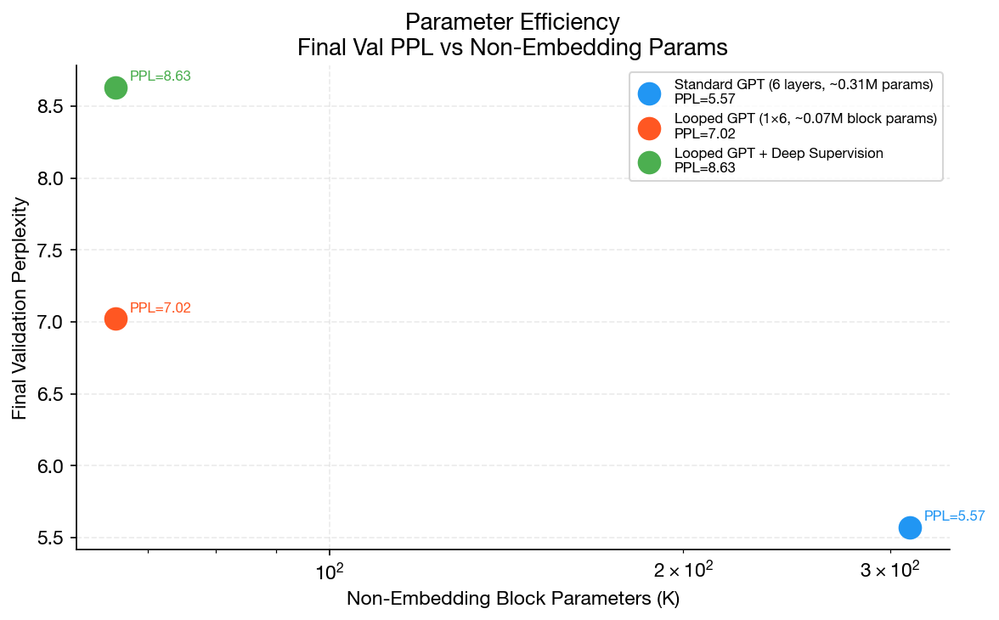
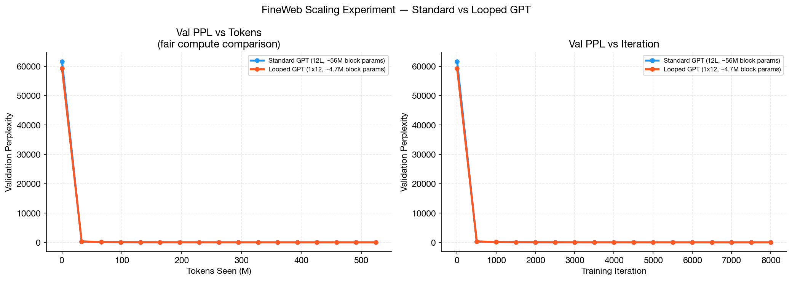
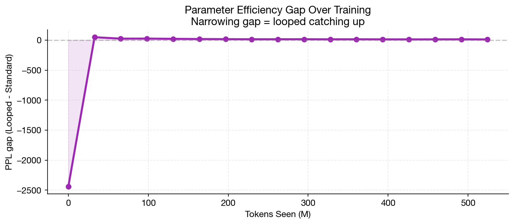
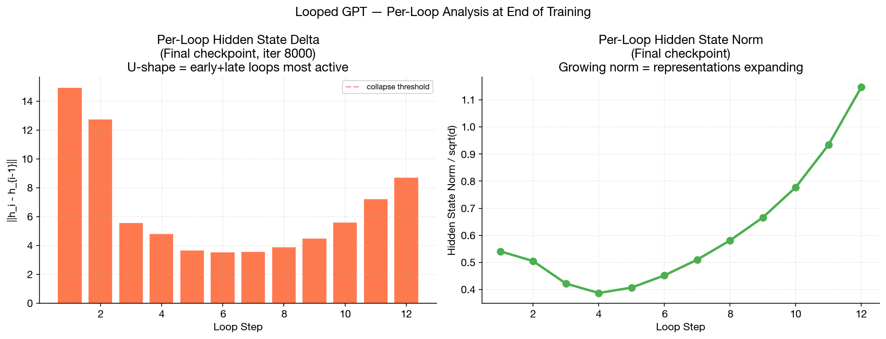
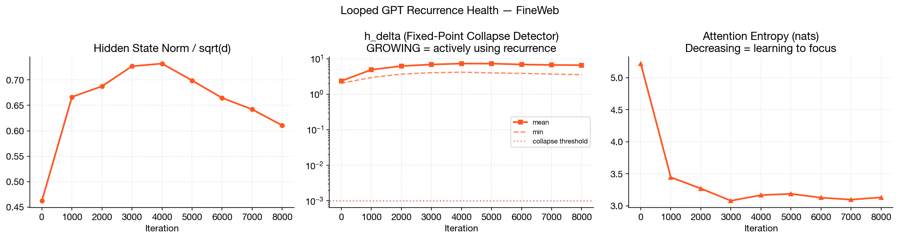
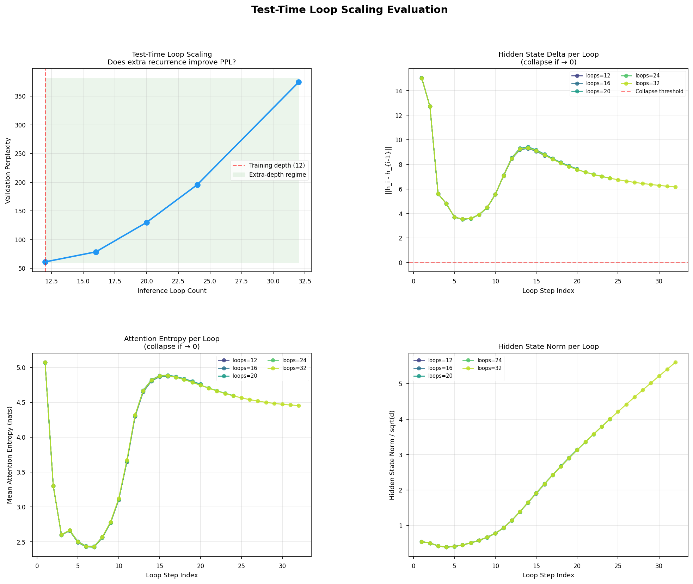
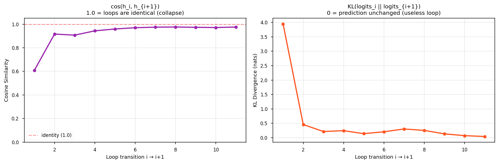

# Looped NanoGPT Experiments

Investigating whether a single transformer block, reused recurrently across N iterations with shared weights, can substitute for N independent unique blocks while retaining competitive language modeling performance.

This is not a claim that recurrent transformers beat standard ones. The question being studied is narrower: how much does parameter count actually matter when compute budget (FLOPs, depth) is held constant?

---

## What was tested

Two model families:

**Standard GPT** — N independent transformer blocks, each with unique weights. This is the standard nanoGPT architecture.

**Looped GPT** — 1 transformer block, applied N times sequentially. All N passes share the same weights. The forward pass is:

```python
x = token_embedding(idx)
for _ in range(N):
    x = shared_block(x)
logits = lm_head(x)
```

A third variant, **Looped GPT with Deep Supervision**, computes a loss at every loop step and combines them with geometric weighting, forcing every iteration to produce a useful prediction.

The architecture is intentionally minimal. No loop embeddings, no adaptive compute, no memory modules, no halting — just repeated application of the same block.

---

## Experiments

### Experiment 1: TinyStories (proof of concept)

Dataset: TinyStories (children's stories, ~2GB)
Context length: 256
Hidden size: 256, 6 layers/loops, 8 heads

| Model | Block params | Val PPL | Tokens trained |
|---|---|---|---|
| Standard GPT (6 layers) | 312K | 5.57 | 327M |
| Looped GPT (1 block x 6) | 66K | 7.02 | 327M |
| Looped + Deep Supervision | 66K | 7.43 | 327M |

4.75x fewer block parameters, 1.45 PPL gap.

### Experiment 2: FineWeb-Edu (scaling)

Dataset: FineWeb-Edu sample-10BT, first 100M tokens streamed
Context length: 512
Hidden size: 768, 12 layers/loops, 12 heads
Effective batch: 65,536 tokens/step (batch=16, grad_accum=8)

| Model | Block params | Val PPL | Tokens trained |
|---|---|---|---|
| Standard GPT (12 layers) | ~56M | 44.91 | 524M |
| Looped GPT (1 block x 12) | ~4.7M | 56.57 | 524M |

12x fewer block parameters, 11.7 PPL gap. The gap was ~25 PPL at 65M tokens and narrowed to ~12 PPL by 524M tokens.

---

## Key findings

**1. No fixed-point collapse at either scale.**

The main failure mode for recurrent transformers is that the hidden state converges to a fixed point — later loops become identity functions. This did not happen.

```
FineWeb looped, final checkpoint:
  h_delta_min per loop: 3.54  (collapse threshold: 0.001)
```

We are 3500x above the collapse threshold at the end of training.

**2. h_delta grows during training.**

As training progresses, the per-loop hidden state change increases, not decreases:

```
iter 1000: h_delta_mean = 4.88
iter 3000: h_delta_mean = 6.86
iter 5000: h_delta_mean = 7.26
```

The model learns to use the recurrence more aggressively over time.

**3. The per-loop delta profile is U-shaped.**

At the final FineWeb checkpoint, the delta across the 12 loops is:

```
[14.9, 12.7, 5.6, 4.8, 3.7, 3.5, 3.6, 3.9, 4.5, 5.6, 7.2, 8.7]
```

Early loops and late loops do substantially more work than middle loops. This is a structured pattern, not uniform or random.

**4. Attention entropy sharpens over training.**

```
iter 0:    attn_ent = 5.22 nats
iter 5000: attn_ent = 3.19 nats
```

**5. Deep supervision shows per-loop refinement.**

TinyStories DS model, per-loop CE loss at final checkpoint:

```
3.10 -> 2.19 -> 1.95 -> 1.88 -> 1.86 -> 1.86
```

Loss drops 1.24 nats from loop 1 to loop 5. Loops 5 and 6 converge, suggesting saturation at 6 loops for this task/scale.

**6. The PPL gap narrows with more training.**

At 65M tokens: ~25 PPL gap. At 524M tokens: ~12 PPL gap. The looped model is a slow starter that benefits more from continued training than the standard model.

---

## Results

### TinyStories









### FineWeb Scaling









---

## Test-time loop scaling

The trained FineWeb looped checkpoint (12 loops) is evaluated at 16, 20, 24, and 32 inference loops — depths it was never trained at.

| Loops | Val Loss | Val PPL | vs train PPL |
|---|---|---|---|
| 12 (train) | 4.114 | 61.2 | — |
| 16 | 4.365 | 78.6 | +17.4 |
| 20 | 4.867 | 129.9 | +68.7 |
| 24 | 5.276 | 195.6 | +134.5 |
| 32 | 5.926 | 374.5 | +313.3 |

Extra loops hurt, monotonically and substantially. The model has not learned to use recurrence beyond its training depth — it degrades rather than improving. This is a meaningful negative result.

The KL divergence between successive loop logits explains why:

```
KL(loop i -> loop i+1):
[3.95, 0.45, 0.21, 0.24, 0.14, 0.20, 0.30, 0.25, 0.13, 0.07, 0.04]
```

The first transition has KL = 3.95, meaning the initial raw embedding is radically different from the first refined state. After that, each loop makes progressively smaller updates — the final transition (loop 11 to 12) has KL = 0.04. The model has nearly converged within its trained depth.

Adding more loops forces the block to keep running on a representation it was trained to stop refining at step 12. The output drifts rather than improving.

This rules out test-time compute scaling (at least without any training signal encouraging it). To get beneficial extra-loop behaviour, the model would need to either: be trained with variable loop counts, or use some stopping criterion.





---

## Repo structure

```
model/
  model_looped.py         StandardGPT, LoopedGPT, LoopedGPTDeepSupervision

training/
  train_experiment.py     Training loop with diagnostic logging
  configurator.py         Config utility from nanoGPT

config/
  train_tinystories_*.py  TinyStories experiment configs
  train_fineweb_*.py      FineWeb scaling configs

data/
  tinystories/prepare.py  TinyStories tokenisation
  fineweb/prepare.py      FineWeb-Edu streaming tokenisation (100M tokens)

analysis/
  diagnostics.py          h_delta, attn_ent, grad norm plots
  loop_scaling.py         Test-time loop scaling evaluation
  compare_params.py       Parameter breakdown utility
  plot_tinystories.py     TinyStories result figures
  plot_fineweb.py         FineWeb result figures

results/
  metrics/                Raw CSV logs from all training runs
  tinystories/figures/    Plots for Experiment 1
  fineweb/figures/        Plots for Experiment 2
```

---

## Running

```bash
pip install torch transformers datasets tiktoken pandas matplotlib
```

```bash
python data/fineweb/prepare.py   # streams 100M tokens, no full download needed
python training/train_experiment.py config/train_fineweb_standard.py
python training/train_experiment.py config/train_fineweb_looped.py
python analysis/plot_fineweb.py
```

Test-time loop scaling:

```bash
python analysis/loop_scaling.py \
    --ckpt out-fineweb-looped/ckpt.pt \
    --data data/fineweb/val.bin \
    --loops 12 16 20 24 32
```

---

## Hardware

A100 80GB, single GPU.
TinyStories: ~2h total. FineWeb: ~1h40min (standard), ~2h40min (looped).

---

## Relation to Ouro / LoopLM (arXiv 2510.25741)

The paper [Scaling Latent Reasoning via Looped Language Models](https://arxiv.org/abs/2510.25741) (Zhu et al., 2025) proposes a closely related architecture called LoopLM, and trains models up to 2.6B parameters on 7.7T tokens.

The base looped architecture — one shared transformer block applied N times — is the same in both. The similarities end there.

Ouro's main contribution is an **entropy-regularized depth allocation objective** that lets each token dynamically decide how many loop iterations it needs during training. This makes the computation adaptive per token and per layer, and is what enables their strong reasoning benchmark results.

This experiment does **not** implement that mechanism. The loop count is fixed at N for every token on every forward pass, with no learned stopping or depth weighting beyond the deep supervision variant. The experiment was explicitly designed to study the simplest possible version of the architecture — fixed depth, no adaptivity — to isolate whether the core weight-sharing idea alone provides parameter efficiency.

The test-time scaling failure (extra loops degrade PPL) is directly explained by the absence of adaptive depth training. Ouro trains with variable loop counts, which is what allows it to generalise beyond a fixed depth. The negative result here is consistent with what you'd expect: without that signal, the model learns to converge in exactly N steps and is not robust to more.

If you want to replicate Ouro specifically, the key addition is the entropy-regularized objective and training with a distribution over loop counts rather than a fixed one.

---

## Based on

[nanoGPT](https://github.com/karpathy/nanoGPT) by Andrej Karpathy. Training loop and data pipeline adapted from nanoGPT. Looped architecture, deep supervision variant, and all diagnostic code are original.
